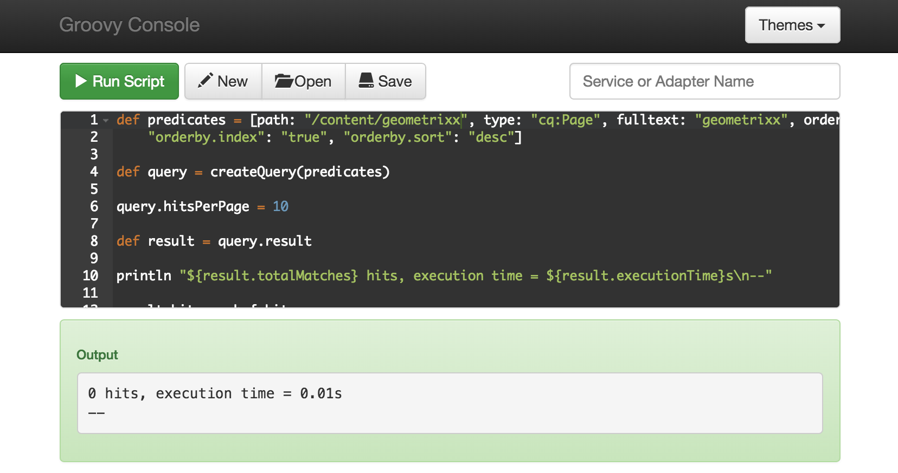

# AEM Groovy Console

[ICF Olson](http://www.icfolson.com)

## Overview

The AEM Groovy Console provides an interface for running [Groovy](http://www.groovy-lang.org/) scripts in the AEM container.  Scripts can be created to manipulate content in the JCR, call OSGi services, or execute arbitrary code using the AEM, Sling, or JCR APIs.  After installing the package in AEM (instructions below), see the [console page](http://localhost:4502/etc/groovyconsole.html) for documentation on the available bindings and methods.  Sample scripts are included in the package for reference.

## Requirements

* AEM 6.3 running on localhost:4502
* Versions 9.x.x and 10.x.x are compatible with AEM 6.2
* Versions 8.x.x are compatible with AEM 6.1
* Versions 7.x.x are compatible with AEM 6.0
* Versions 5.x.x and 6.x.x are compatible with CQ 5.6
* Versions 3.x.x are compatible with CQ 5.4 and 5.5
* [Maven](http://maven.apache.org/) 3.x

## Installation

1. [Download the console package](https://github.com/OlsonDigital/aem-groovy-console/releases/download/11.0.0/aem-groovy-console-11.0.0.zip).  For previous versions, tags can be checked out from GitHub and built directly from the source (e.g. `mvn install`).

2.  [Verify](http://localhost:4502/etc/groovyconsole.html) the installation.

Additional build profiles may be added in the project's pom.xml to support deployment to non-localhost AEM servers.

AEM 6.0 no longer allows vanity paths for pages in /etc by default.  To enable access to the Groovy Console from /groovyconsole as in previous versions, the Apache Sling Resource Resolver Factory OSGi configuration must be updated to allow vanity paths from /etc.  The Groovy Console Configuration Service can then be updated to enable the vanity path if so desired.

## Context Path Support

If you are running AEM with a context path, set the Maven property `aem.context.path` during installation.

    mvn install -P local -Daem.context.path=/context

## Extensions

Beginning in version 7.0.0, the Groovy Console provides extension hooks to further customize script execution.  The console exposes an API containing three extension provider interfaces that can be implemented as OSGi services in any bundle deployed to an AEM instance.  See the default extension providers in the `com.icfolson.aem.groovy.console.extension.impl` package for examples of how a bundle can implement these services to supply additional script bindings, metaclasses, and star imports.

### Notifications

To provide custom notifications for script executions, bundles may implement the `com.icfolson.aem.groovy.console.notification.NotificationService` interface (see the `com.icfolson.aem.groovy.console.notification.impl.EmailNotificationService` class for an example).  These services will be dynamically bound by the Groovy Console service and all registered notification services will be called for each script execution.

## Notes

Sample scripts can be found in the `src/main/scripts` directory.

## Versioning

Follows [Semantic Versioning](http://semver.org/) guidelines.